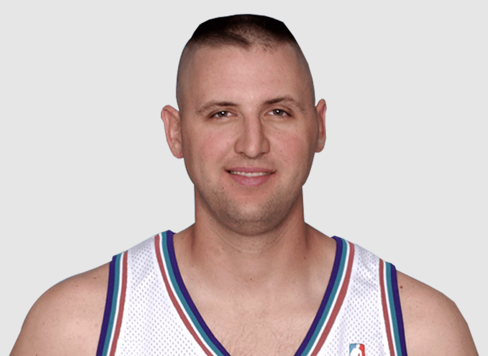

<center> 

<h1>Firstname Lastname</h1>

<a href="mailto:email@address.com" class = "link">Email</a> <a class = "vert">|</a> <a href="content/cv.pdf" class = "link">CV</a> 


Job Title </center>

<center> [Employer](youremployer.com) </center> 

\newline

#  {.tabset .tabset-fade}

## About

This is the area for your bio. Edit this with your information. Link to stuff like [this](wikipedia.org). The tabs are set with the headings next to the ##. The headings under (education, interests...) are from the ###. You can change these headings to whatever. Put a pdf of your CV in the content folder and name it 'cv.pdf'.

<hr style="height:1px;border-width:0;color:#ECF0F1;background-color:#ECF0F1">


### Education

- PhD, Field (year) | _School of Hard Knocks_
- MA, Field (year) | _School of Hard Knocks_
- BA, Field (year) | _School of Hard Knocks_

<hr style="height:1px;border-width:0;color:#ECF0F1;background-color:#ECF0F1">

### Interests

- Whatever
- You
- Want

<hr style="height:1px;border-width:0;color:#ECF0F1;background-color:#ECF0F1">

## Publications

- [CPaper Title 1. __Bolded Publication Name__ (Year), with Coauthors.](linktothepaperonline.com)

- [Paper Title 2. __Bolded Publication Name__ (Year).](linktothepaperonline.com) <a href="content/direct_to_pdf.pdf" class = "smalllink">[PDF]</a> 

## Current Projects


_Click and expand for details_


<details>
<summary>
__Project Title 1__
</summary>
__Summary:__ Project description goes here. Each project will fall within the tags. The project title is clickable to expand. The summary appears after expanding. You can also add images using this chunk below, which calls the images from the 'img' folder.

```{r image1, echo=FALSE, out.width = '100%'}

```
</details>


<details>
<summary>
__Project Title 2__
</summary>
__Summary:__ You can also not include an image if you want. More text blah blah.
</details>

<details>
<summary>
__Project Title 3__
</summary>
__Summary:__ You can also not include an image if you want. More text blah blah.
</details>


## Teaching


### Experience:
- Item 1
- Item 2
- Item 3


